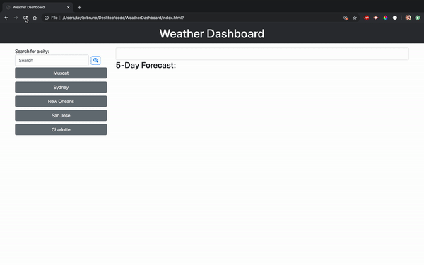

# WeatherDashboard
##### This weather dashboard will allow the user to search for a city and displays the current weather conditions and a 5 day forecast. 

## Description
Each city is saved into local storage which will be display as buttons for easy access to the 5 most recently searched cities, all at the click of a button. 

Icons are displayed based on weather conditions and on hover will display the meaning of the icon. 

On launch, the user will be prompted for their location. If allowed, then dashboard will load weather conditions for the current location.

UV Index is displayed color coded based on the [EPA UV Index Scale](https://www.epa.gov/sunsafety/uv-index-scale-0).

## Built With
* HTML
* CSS
* JavaScript
* [Bootstrap](https://getbootstrap.com/)
* [jQuery](https://jquery.com/)
* [OpenWeather](https://openweathermap.org/)

### Assignment
> Build a weather dashboard application with search functionality to find current weather conditions for multiple cities.